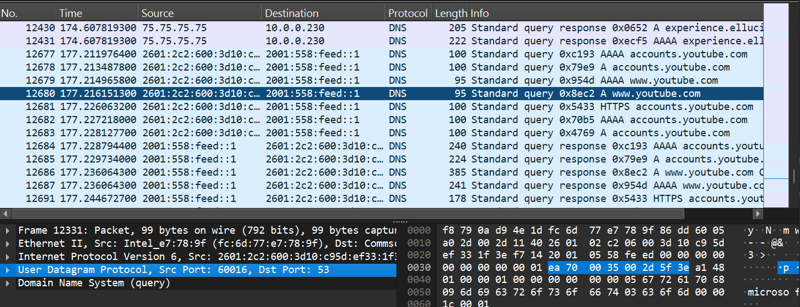
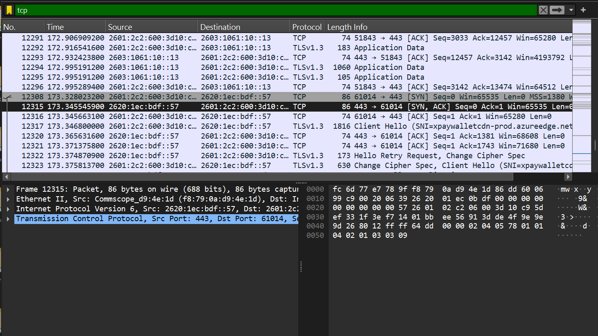
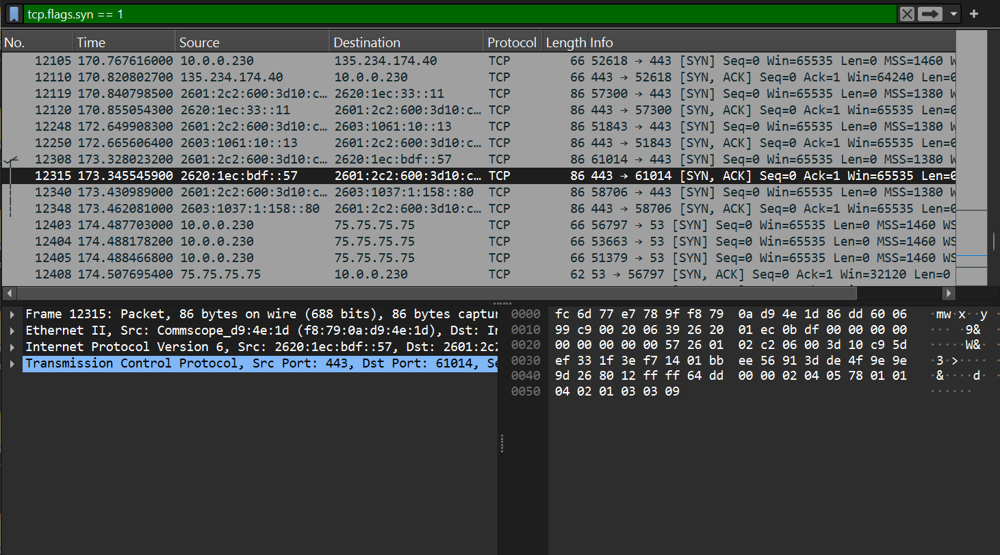
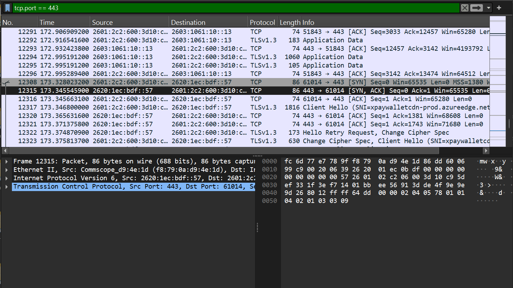

# wireshark-network-analysis
## Overview
This project focuses on capturing and analyzing basic network traffic using Wireshark. The goal was to better understand how devices communicate across a network and how cybersecurity professionals inspect packet-level activity.

## Tools Used
- Wireshark
- Windows 11
- Web Browser
- GitHub

## Traffic Analyzed
- DNS requests
- TCP packets
- TCP three-way handshake
- HTTPS/TLS traffic
- Source and destination IP addresses

## What I Did
I captured live network traffic while visiting websites and using normal internet activity. I then applied Wireshark filters to identify DNS lookups, TCP communication, HTTPS traffic, and packet flow between my device and remote servers.

## Key Findings
- DNS traffic showed how domain names are translated into IP addresses.
- TCP traffic showed how devices establish reliable communication.
- The TCP three-way handshake included SYN, SYN-ACK, and ACK packets.
- HTTPS traffic used port 443 and showed encrypted web communication.

## What I Learned
This project helped me understand how network traffic is captured, filtered, and analyzed. It strengthened my knowledge of basic networking, packet behavior, troubleshooting, and cybersecurity monitoring.

## DNS Traffic

## TCP Traffic

## TCP Handshake

## HTTPS/TLS Traffic

## Screenshots
Screenshots are included in the screenshots folder.
